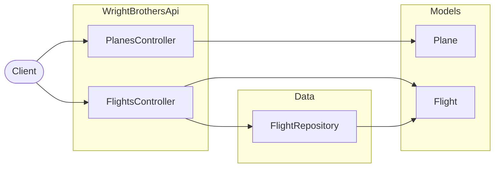

# 15. Copilot on GitHub Web + Mermaid diagrams lab

## Goal
Use GitHub.com + Copilot to understand code and generate a simple architecture diagram in Markdown.

## Time
15–20 minutes

## Part A — Copilot on GitHub Web
1. Open https://github.com and navigate to this repository.
2. Open `code/WrightBrothersApi/Program.cs`.
3. Use Copilot Chat on GitHub (if available) and ask:
   - “Explain how this API is configured and what middleware is used.”
   - “Where is CORS configured and what does it allow?”

## Part B — Mermaid diagram (works great in Markdown)
Create a new Markdown snippet (in a PR description, issue, or a docs file) with a Mermaid diagram.

### Prompt
- “Generate a Mermaid diagram showing: Client → API (PlanesController, FlightsController) → Repository (FlightRepository) → Models. Keep it simple.”
### Example output (compare yours to this)

### Example target structure
- client calls endpoints
- controllers return models
- repository provides flight data

## Success criteria
- You can show Copilot being useful in GitHub.com.
- You produce a readable Mermaid diagram that matches this repo.

## Instructor note
If Mermaid rendering is not enabled in your GitHub context, still keep the diagram text—participants can preview it locally in VS Code Markdown.
